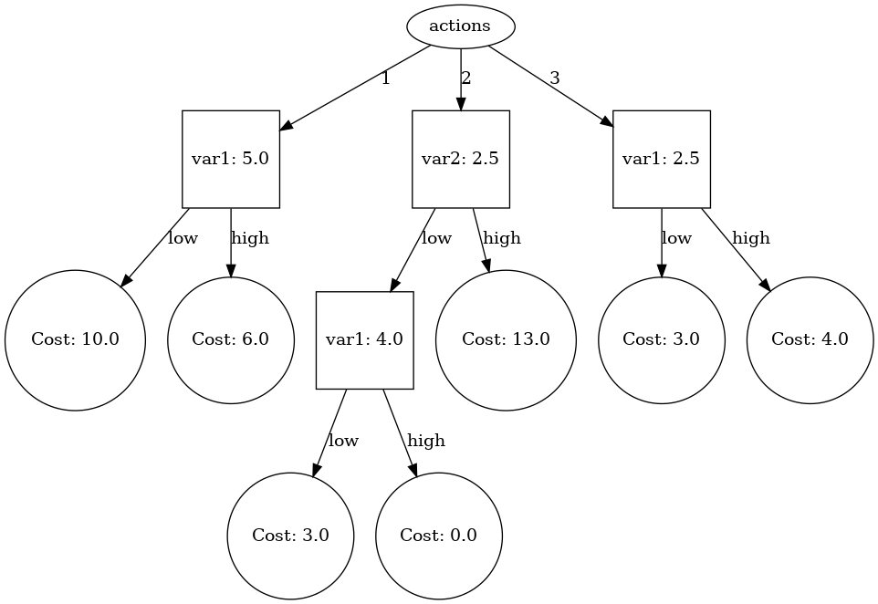

# Working with RL strategies as decision trees (or Q-trees)

Currently messy. But you can draw trees.

## Draw trees

Make a virtual environment, activate it and run `pip install -r
requirements.txt` (which currently just installs `pydot` that is necessary for
actually drawing the graph).

Then, you can run the following command

```
python draw_tree.py <path/to/strategy.json> -o output.png
```

which will load the strategy in `strategy.json` and draw it as a graph which is
written to the file `output.png`. If `strategy.json` has more than one
`regressor`, then the program will ask you to choose just one of them to plot.

Here is an example of a tree drawn from `testStrategy.json` where regressor
`(1)` has been chosen:


