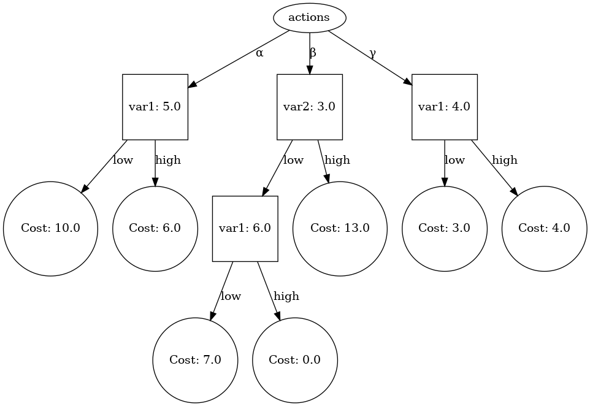
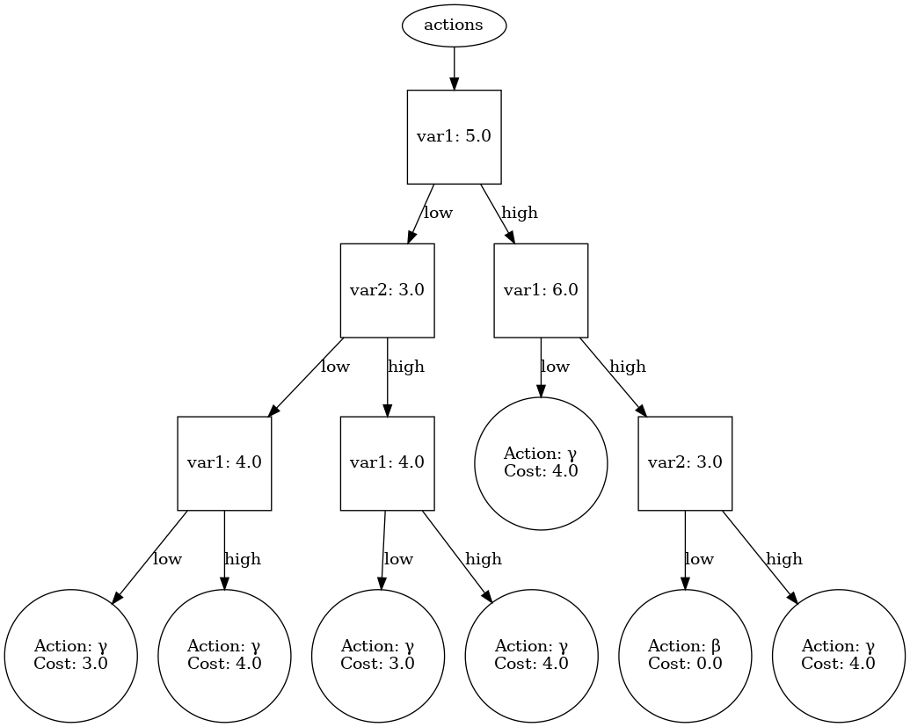
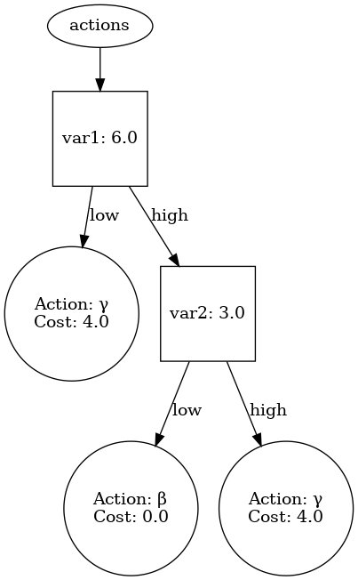

# Working with RL strategies as decision trees (or Q-trees)

Library to work with Reinforcement Learning strategies represented as Q-value
trees. That is, the Q-values of each state/action pair is stored in the leaf
nodes of a decision tree representing one possible action. A complete strategy
is thus given by having one tree for each possible action.

The representation is based on the json output of strategies trained with
 [UPPAAL Stratego](https://people.cs.aau.dk/~marius/stratego/).

---

## Draw trees

Make a virtual environment, activate it and run `pip install -r
requirements.txt` (which currently just installs `pydot` that is necessary for
actually drawing the graph).

Then, you can run the following command

```
python draw_tree.py <path/to/strategy.json> -o output.png
```

which will load the strategy in `strategy.json` and draw it as a graph which is
written to the file `output.png`. If `strategy.json` has more than one
`regressor`, then the program will ask you to choose just one of them to plot.

Here is an example of a tree drawn from `exampleStrategy.json` where regressor
`(1)` has been chosen:



## Convert Q-trees to decision trees

Currently, this can't be done from the command line. But to - in a completely
naive way - take a set of trees representing a complete strategy and turn it
into a single tree with the best actions in the leaf nodes, you can do the
following:

```python
from trees.models import State
from trees.utils import load_tree

# load tree and extract leafs
roots, variables, actions = load_tree("path/to/strategy.json")
leafs = [l for ls in [root.get_leafs() for root in roots] for l in ls]

# make a root node and build from that
root = Node.make_root_from_leaf(leafs[0])
for i in range(1, len(leafs)):
    root = root.put_leaf(leafs[i], State(variables))
```

The result of this conversion based on the example above (the test strategy in
`examples/exampleStrategy.json`), yields the following decision tree:



However, we can get a better (smaller) representation of this tree by sorting
the leafs according to cost value first. This is done automatically if we call
the handy class method `make_decision_tree_from_leafs(leafs)` on `Node`. The
resulting tree is shown below.



Examples involving a larger strategy can be found in `examples/`.

### Export back to UPPAAL

Currently, UPPAAL doesn't accept strategies in the decision tree format, so to
actually try the decision tree strategies in a real UPPAAL setting, we need to
convert it back to Q-trees. This can easily be done by calling 
`root.to_q_trees(actions)` which essentially outputs a copy of `strategy` for 
each action in `actions`, but where each copy is modified so that every leaf
corresponding to the current action is given a very low cost (default 0) and
all other leaves are given a very large cost.

To actually get a working json file that can be loaded into UPPAAL follow this
example:

```python
import json
from trees.models import Node
from trees.utils import load_tree, get_uppaal_data

# need to set this manually (currently only one location is supported)
loc = "(1)"

# set verbosity=1 to get necessary meta-data about the strategy
roots, variables, actions, meta = load_tree(
    "/path/to/strategy.json",
    loc=loc,
    verbosity=1
)

# the meta data could also be obtained directly
with open("/path/to/strategy.json", "r") as f:
    meta = get_uppaal_data(json.load(f))

# convert Q-trees to decision tree
leafs = [l for ls in [root.get_leafs() for root in roots] for l in ls]
strategy = Node.make_decision_tree_from_leafs(leafs)

# convert back to Q-trees
action_tree_pairs = strategy.to_q_trees(actions)

# we need a mapping from variable to a variable index
var_map = { v: i for i, v in enumerate(variables) }

# insert into the strategy meta data
for action, root in action_tree_pairs:
    meta['regressors'][loc]['regressor'][action] = root.to_uppaal(var_map)

# export to json and be happy!
with open("myConvertedStrategy.json", "w") as f:
    json.dump(meta, f, indent=4)
```

## Empirically prune decision trees

When UPPAAL learns a strategy, it will most likely generate a lot of partitions
early on in the training, which will turn out to be quite irrelevant to the
final controller. In other words, the strategy will contain information about
parts of the state space, that in actuality is rarely (if ever) visited. On top
of that, this information will also most likely be based on very little actual
experience.

To prune the strategies of these superfluous partitions, we can generate a
sample run (or several), count the visits to each leaf in the decision
tree strategy and then remove all leaves visited less than some threshold.

The function `trees.utils.count_visits` takes 4 arguments: the
decision tree strategy, the sample data as a list of 
`[timestep, var_1, var_2, ..., var_n]` entries, a list of variables `[var_1,
var_2, ..., var_n]` and an optional step parameter, that defaults to 1 (this is
for only evaluating every `step` entry in the sample data). An output like this
can be generated via the command line using

```sh
/path/to/uppaal_application/bin/verifyta \
    /path/to/model.xml \
    /path/to/query_file.q \
    --sampling-time 0.1
```

which creates a file `./sampling.log` with an entry for every 0.1 timestep (vary
according to needs).

Calling `count_visits(strategy, data, variables)` will add statistics to each
leaf in `strategy` about the number and frequency of visits, which can then be
used by `Node.emp_prune(strategy)` to remove all leaves that is never visited.
`Node.emp_prune` accepts an optional argument `thresh` which can be provided to
prune even more strict.

#### Example

```python
from trees.models import Node
from trees.utils import load_tree, parse_from_sampling_log, count_visits

# import strategy and convert to decision tree
roots, variabels, actions = load_tree("/path/to/strategy.json")
leafs = [l for ls in [root.get_leafs() for root in roots] for l in ls]
strategy = Node.make_decision_tree_from_leafs(leafs)

# parse sampling data and gather statistics
data = parse_from_sampling_log("/path/to/sampling.log")
count_visits(strategy, data, variables)

# prune leaves only visited 3 or few times
thresh = 3 / len(data)
Node.emp_prune(strategy, thresh=thresh)
```
